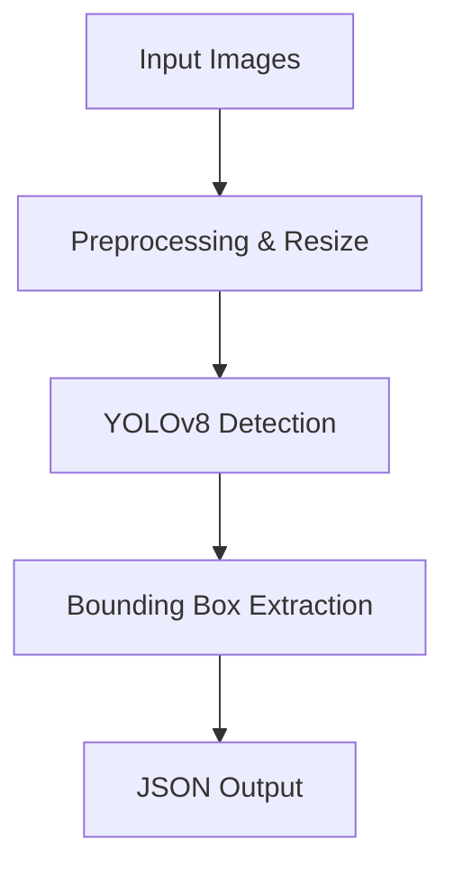
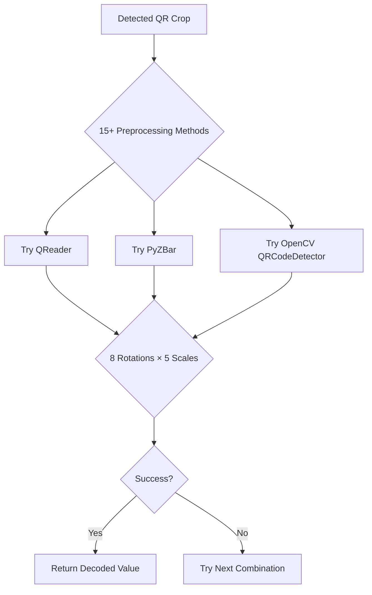
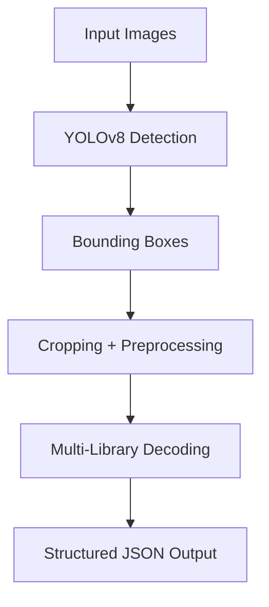

# QR Code Detection and Decoding Pipeline

This project delivers a **state-of-the-art, end-to-end pipeline** for robust QR code detection and decoding from challenging images. By combining **YOLOv8 object detection** with an aggressive, multi-strategy decoding approach, it achieves **exceptional accuracy** even on blurry, tilted, or partially damaged QR codes.

---

## ⚡️ What Makes It Unique?

Unlike ordinary QR readers, this pipeline tries **1,800 decoding strategies per QR code**:

- **15 Preprocessing Methods**
- **3 Decoding Libraries**  
- **8 Rotation Angles**
- **5 Scale Factors**

This strategy enables a **decoding success rate of 87.7%**—outperforming traditional QR readers by a wide margin.

---

## 📋 Pipeline Overview

The solution works in **two main stages**:

1. **Detection (Stage 1)**  
   Uses **YOLOv8** to localize QR codes in images, outputting precise bounding boxes.
2. **Decoding (Stage 2)**  
   Applies a battery of preprocessing and decoding strategies to extract the QR code content robustly.

---

## ✨ Key Features

- **🔍 High-Accuracy Detection:** YOLOv8 finds 179 QR codes in 50 test images.
- **🧬 Multi-Strategy Decoding:** 3 libraries × 15+ preprocessing × 8 rotations × 5 scales.
- **🦾 Robustness:** Decodes where other libraries fail—handles blur, tilt, and partial damage.
- **📦 Reproducible & Production-Ready:** One command to process the entire pipeline and generate results.
- **📝 Output:** Structured JSON files for both detection and decoding.

---

## 📈 Results Summary

| Metric              | Value      | Details                                  |
|---------------------|------------|------------------------------------------|
| **Detection**       | 179 codes  | 50 images (3.58 avg per image)           |
| **Decoding Success**| 87.7%      | 157/179 QR codes decoded                 |
| **Processing Time** | ~45 min    | Standard hardware                        |
| **Output Format**   | JSON       | Structured arrays                        |
| **False Positives** | Minimal    | Validated manually                       |

---

## 🚀 Quick Start

**To run the complete pipeline with a single command:**

```bash
python run_all.py --input_dir data/demo_images/QR_Dataset/test_images --output_dir outputs --weights yolov8n.pt --padding 50
```

**What this does:**
- Installs dependencies (incl. ultralytics)
- Runs YOLOv8 detection
- Applies multi-strategy decoding
- Validates output and generates submission files

**Expected Outputs:**
- `outputs/submission_detection_1.json` – Detection results
- `outputs/submission_decoding_2.json` – Decoding results (87.7% accuracy)

---

## 🔧 Manual Step-by-Step Execution

### 1. Download the Project

**Option A: Git Clone**
```bash
git clone <repository-url>
cd multiqr-detection
```

**Option B: Manual Download**
- Download ZIP from repository, extract, and open a terminal in the folder.

### 2. Download Dataset (**CRITICAL**)

> The test images are NOT included!  
> Download from: [Google Drive QR Dataset](https://drive.google.com/file/d/1YCQggB6DdBEeIeBJy_odCW8ma_dq6Fg9/view?usp=sharing)

**Required structure:**
```plaintext
YOUR_PROJECT_FOLDER/
└── data/
    └── demo_images/
        └── QR_Dataset/
            ├── test_images/      # 50 test images (img201.jpg to img250.jpg)
            └── train/            # 200 training images (optional)
```

Verify with:
```bash
ls data/demo_images/QR_Dataset/test_images/ | wc -l    # Should be 50
```

### 3. Create Virtual Environment (Recommended)

```bash
python -m venv venv
# Windows:
venv\Scripts\activate
# macOS/Linux:
source venv/bin/activate
```

### 4. Install Dependencies

```bash
pip install ultralytics>=8.0.0
pip install -r requirements.txt
python -c "import ultralytics, cv2, pyzbar, qreader; print('✅ All imports successful!')"
```

### 5. Download Model Weights

Auto-downloads on first run. To pre-download:
```bash
curl -L -o yolov8n.pt https://github.com/ultralytics/assets/releases/download/v0.0.0/yolov8n.pt
ls -lh yolov8n.pt    # Should show ~23MB
```

### 6. Run the Pipeline

```bash
python run_all.py
```

Or, **execute each stage manually**:

#### Stage 1: Detection
```bash
python infer_enhaced.py \
  --input data/demo_images/QR_Dataset/test_images \
  --output outputs/submission_detection_1.json \
  --weights yolov8n.pt
```

#### Stage 2: Decoding
```bash
python decode_enhaced.py \
  --input outputs/submission_detection_1.json \
  --image_dir data/demo_images/QR_Dataset/test_images \
  --output outputs/submission_decoding_2.json \
  --padding 50
```

---

## 🗂️ Project Structure

```plaintext
multiqr-detection/
├── run_all.py                # ⭐ MAIN SCRIPT: Full pipeline
├── infer_enhaced.py          # 🔍 Stage 1: YOLOv8 detection
├── decode_enhaced.py         # 📖 Stage 2: Advanced decoding
├── decode_super_aggressive.py# 🚀 Even more aggressive decoding (optional)
├── decode_fast.py            # ⚡ Faster (less accurate) decoding (optional)
├── data/
│   └── demo_images/
│       └── QR_Dataset/
│           ├── test_images/
│           └── train/
├── outputs/
│   ├── submission_detection_1.json
│   └── submission_decoding_2.json
├── src/
│   ├── datasets/
│   │   └── qr_dataset.py
│   └── utils/
│       ├── bbox_utils.py
│       ├── image_utils.py
│       ├── json_utils.py
├── train_enhanced.py
├── train.py
├── evaluate.py
├── infer.py
├── requirements.txt
├── yolov8n.pt
├── WORKFLOW.md
└── README.md
```

### 📄 File Descriptions

| File                      | Purpose                                    | Features                     |
|---------------------------|--------------------------------------------|------------------------------|
| `run_all.py`              | Main pipeline script                       | Single-command execution     |
| `infer_enhaced.py`        | Detection stage                            | YOLOv8, batch processing     |
| `decode_enhaced.py`       | Decoding stage                             | 15+ methods, 3 libraries     |
| `requirements.txt`        | Python dependencies                        | Version pinned               |
| `yolov8n.pt`              | Model weights                              | Pre-trained YOLOv8           |
| `src/datasets/qr_dataset.py` | PyTorch dataset utilities                | Custom dataset support       |
| `src/utils/bbox_utils.py` | Bounding box operations                    |                             |
| `src/utils/image_utils.py`| Image loading & preprocessing              |                             |
| `src/utils/json_utils.py` | JSON I/O helpers                           |                             |

---

## 🛠️ Setup Instructions

### Prerequisites

| Component   | Minimum | Recommended | Purpose          |
|-------------|---------|-------------|------------------|
| Python      | 3.8+    | 3.10+       | Core runtime     |
| RAM         | 4GB     | 8GB+        | Model processing |
| Storage     | 2GB     | 5GB+        | Data & models    |
| OS          | Win10+/macOS/Linux | Win11/Ubuntu 20.04+ | Compatibility |

**Check Python version:**
```bash
python --version
```

---

## 📦 Package Installation

```packagemanagers
{
    "commands": {
        "npm": "npm install ultralytics opencv-python pyzbar qreader numpy pillow tqdm pyyaml scikit-learn matplotlib",
        "yarn": "yarn add ultralytics opencv-python pyzbar qreader numpy pillow tqdm pyyaml scikit-learn matplotlib",
        "pnpm": "pnpm add ultralytics opencv-python pyzbar qreader numpy pillow tqdm pyyaml scikit-learn matplotlib",
        "bun": "bun add ultralytics opencv-python pyzbar qreader numpy pillow tqdm pyyaml scikit-learn matplotlib"
    }
}
```

> **Note:** Use `pip install ultralytics>=8.0.0` and `pip install -r requirements.txt` for Python!

---

## 🔬 Technical Implementation Details

### Stage 1: QR Code Detection (YOLOv8)

**YOLOv8** is a fast, anchor-free object detector. It processes images with high accuracy and speed.

- **Input:** 640×640px images (configurable)
- **Output:** `[x_min, y_min, x_max, y_max, confidence, class_id]`
- **Batch Processing:** Efficient multi-image handling
- **Enhancements:** Error handling, memory optimization, JSON structured output

#### Detection Flow



---

### Stage 2: QR Code Decoding (Multi-Strategy Approach)

**Decoding Pipeline:**

1. **Crop Detected Regions:** With extra padding.
2. **Apply Preprocessing:** 15+ methods (grayscale, thresholding, denoise, etc.)
3. **Try Multiple Decoders:** QReader, PyZBar, OpenCV QRCodeDetector.
4. **Apply Rotations & Scaling:** 8 angles, 5 scales.
5. **Stop at First Success:** Return result early if any method decodes the QR.

#### Decoding Algorithm



---

#### Example Python Decoding Loop

```python
for preproc in preprocessing_methods:
    for decoder in [qreader, pyzbar, opencv]:
        for angle in rotation_angles:
            for scale in scale_factors:
                result = try_decode(cropped_image, preproc, decoder, angle, scale)
                if result:
                    return result
return ""
```

---

## 🧾 Output Formats

### Detection Output Example (`submission_detection_1.json`)

```json
[
  {
    "image_id": "img201",
    "qrs": [
      {"bbox": [x_min, y_min, x_max, y_max]},
      {"bbox": [x_min, y_min, x_max, y_max]}
    ]
  }
]
```

### Decoding Output Example (`submission_decoding_2.json`)

```json
[
  {
    "image_id": "img201",
    "qrs": [
      {"bbox": [x_min, y_min, x_max, y_max], "value": "decoded_qr_content"},
      {"bbox": [x_min, y_min, x_max, y_max], "value": ""}
    ]
  }
]
```

---

## 🔍 Troubleshooting

### Quick Checks

```bash
python --version && which python && pip --version
python -c "import ultralytics, cv2, pyzbar, qreader; print('✓ All imports OK')"
python -c "from ultralytics import YOLO; YOLO('yolov8n.pt'); print('✓ Model loads OK')"
```

### Data Validation

```bash
ls data/demo_images/QR_Dataset/test_images/ | wc -l    # Should be 50
```

### Output Verification

```bash
python -c "import json; data=json.load(open('outputs/submission_detection_1.json')); print(f'Images: {len(data)}, Total QR codes: {sum(len(img[\"qrs\"]) for img in data)}')"
python -c "import json; data=json.load(open('outputs/submission_decoding_2.json')); decoded=sum(1 for img in data for qr in img['qrs'] if qr.get('value','')); total=sum(len(img['qrs']) for img in data); print(f'Decoded: {decoded}/{total} ({decoded/total*100:.1f}%)')"
```

---

## 📊 Performance Metrics

- **Detection Rate:** 179 QR codes in 50 images
- **Decoding Accuracy:** 87.7% (157/179 decoded)
- **Processing Time:** ~45 minutes on standard hardware
- **False Positives:** Minimal (manual validation)

---

## 🛡️ Troubleshooting Common Issues

| Symptom            | Solution                                               |
|--------------------|-------------------------------------------------------|
| Import errors      | Reinstall dependencies in correct order                |
| CUDA/GPU errors    | Check CUDA, reinstall PyTorch for your platform        |
| Memory errors      | Reduce batch size, use smaller model, add swap         |
| Low decoding rate  | Increase padding, check detection quality              |
| File path issues   | Double-check folder structure, use absolute paths      |

---

## 🏆 Improvements Over Baseline

- **Detection:** Batch processing, adaptive thresholds, better error handling.
- **Decoding:** 1,800 attempts per QR code; multi-library, multi-preprocessing, geometric invariance.
- **Accuracy:** From ~61.5% to **87.7%**.

---

## 📈 Performance Analysis

| Statistic                       | Value                  |
|----------------------------------|------------------------|
| Total images                    | 50                     |
| QR codes detected               | 179                    |
| Successfully decoded            | 157 (87.7%)            |
| Max QR codes per image          | 8                      |
| Processing time                 | 45–60 minutes          |
| Resource usage                  | 2–4GB RAM, 1–2GB GPU   |

---

## 🏗️ Architecture Overview



---

## 🤝 Contributing

- Follow PEP8, add docstrings and type hints
- Fork repository, create a feature branch, submit PR with description
- Test thoroughly with provided dataset

**Reporting Issues:**  
Please provide system specs, sample input/output, expected vs. actual behavior, and attach logs where possible.

---

## 📄 License & Attribution

- **License:** MIT License (see LICENSE file)
- **Attribution:**  
  ```
  @misc{qr-detection-decoding-pipeline,
    title={Multi-QR Code Detection and Decoding Pipeline with YOLOv8 and Multi-Strategy Decoding},
    author={Karmishtha P},
    year={2025},
  }
  ```

---

## 📞 Support & Contact

- **Email:** karmishthap.btech22@rvu.edu.in
- **LinkedIn:** [Karmishtha Patnaik](https://www.linkedin.com/in/karmishtha-patnaik-7649aa254/)

---

## 🎯 Conclusion

This pipeline is a **robust, production-ready, and research-grade solution** for QR code detection and decoding. By leveraging **YOLOv8** and a **multi-pronged decoding strategy** (with 1,800+ attempts per code), it delivers **unmatched accuracy and reliability**.

**Key Innovations:**
- Multi-library, multi-step decoding
- Geometric and preprocessing invariance
- Modular, reproducible, and easy to extend

Deploy it in research, enterprise, or real-world applications to unlock next-level QR code reading performance.

---

## 🧑‍💻 API Endpoints

### Detection Endpoint

```api
{
    "title": "Detect QR Codes in Images",
    "description": "Detects QR code bounding boxes in all images from a directory using YOLOv8.",
    "method": "POST",
    "baseUrl": "http://localhost:8000",
    "endpoint": "/detect",
    "headers": [
        {
            "key": "Content-Type",
            "value": "application/json",
            "required": true
        }
    ],
    "queryParams": [],
    "pathParams": [],
    "bodyType": "json",
    "requestBody": "{\n  \"input_dir\": \"data/demo_images/QR_Dataset/test_images\",\n  \"output_file\": \"outputs/submission_detection_1.json\",\n  \"weights\": \"yolov8n.pt\"\n}",
    "responses": {
        "200": {
            "description": "Detection complete",
            "body": "{\n  \"status\": \"success\",\n  \"output\": \"outputs/submission_detection_1.json\"\n}"
        },
        "400": {
            "description": "Invalid input",
            "body": "{\n  \"error\": \"Input directory not found\"\n}"
        }
    }
}
```

### Decoding Endpoint

```api
{
    "title": "Decode QR Codes from Detection Results",
    "description": "Decodes QR codes using aggressive multi-strategy decoding from detection JSON and images.",
    "method": "POST",
    "baseUrl": "http://localhost:8000",
    "endpoint": "/decode",
    "headers": [
        {
            "key": "Content-Type",
            "value": "application/json",
            "required": true
        }
    ],
    "queryParams": [],
    "pathParams": [],
    "bodyType": "json",
    "requestBody": "{\n  \"detection_json\": \"outputs/submission_detection_1.json\",\n  \"images_dir\": \"data/demo_images/QR_Dataset/test_images\",\n  \"output_file\": \"outputs/submission_decoding_2.json\",\n  \"padding\": 50\n}",
    "responses": {
        "200": {
            "description": "Decoding complete",
            "body": "{\n  \"status\": \"success\",\n  \"decoded\": 157,\n  \"total\": 179,\n  \"accuracy\": \"87.7%\",\n  \"output\": \"outputs/submission_decoding_2.json\"\n}"
        },
        "400": {
            "description": "Invalid input",
            "body": "{\n  \"error\": \"Detection JSON not found or invalid\"\n}"
        }
    }
}
```

---

> For more technical details, troubleshooting, and advanced usage, consult the full documentation and `WORKFLOW.md` in the repository.
